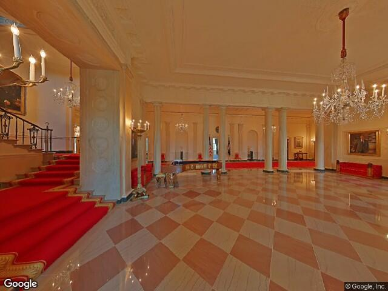
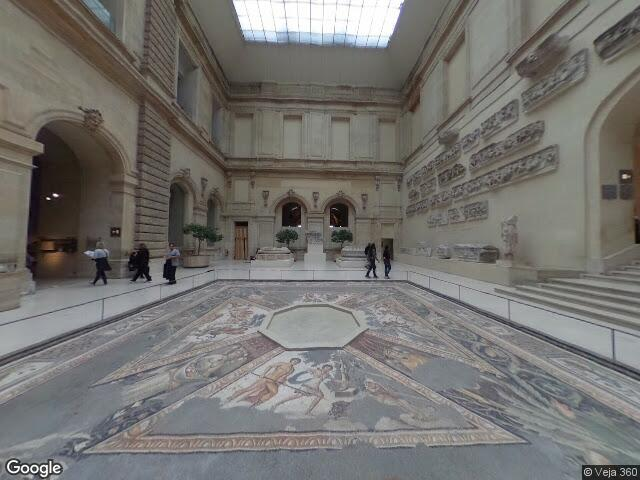
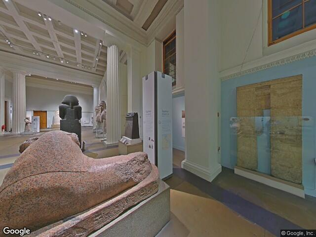
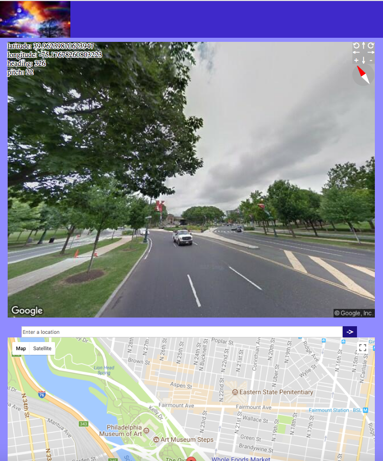

<!DOCTYPE html>
<html>
<h1>Visual Guide</h1>

This Web App was written in Ruby on Rails in the back end, and in HTML, JavaScript in front end, and ActionCable in the back and front end. And it uses Google Map StreetView, Directions, Places APIs.
 

It tries to take you to somewhere you didn't get to, and take a look at it in advance, or take a route to take a look at the scenery of it. 
 
<h3>Take a look at these pictures: </h3>

 

Do you know where they are?

<a href="virtualtravel.herokuapp.com">Try this to find it out.</a> 

You need a Goodle API key. Go <a href="https://developers.google.com/maps/documentation/javascript/get-api-key">here</a> to get one for free, and don't forget going <a href="https://console.developers.google.com/flows/enableapi?apiid=maps_backend,geocoding_backend,directions_backend,distance_matrix_backend,elevation_backend,places_backend&reusekey=true">here</a> to enable Street View, Directions, and Places APIs. It may take you a few minutes, but it worth it.
 

When you registered or logged in, you get this:

 

Click the avatar to show the main menu:

 

<h3>Enjoy it and have fun!</h3>
</html>
